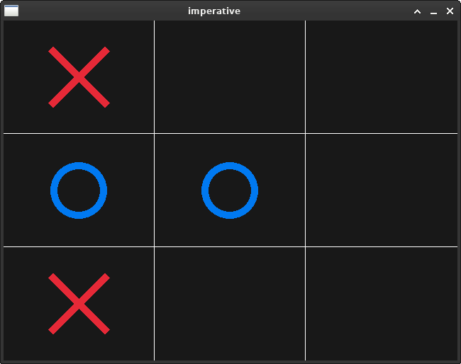

### Project to compare imperative and functional programming by implementing tic tac toe in C and Haskell

#### Quick Start tic tac toe in C

* Install raylib

`git clone git@github.com:toxypiks/tic_tac_toe.git`\
`cd tic_tac_toe`\
`mkdir build`\
`cd build`\
`cmake ..`\
`make`\
`./main`\

#### Program structure tic tac toe in C

* game.h contains all complex data structures
* logic.c contains all functions to execute the game logic
* rendering.c contains all functions to render the game

